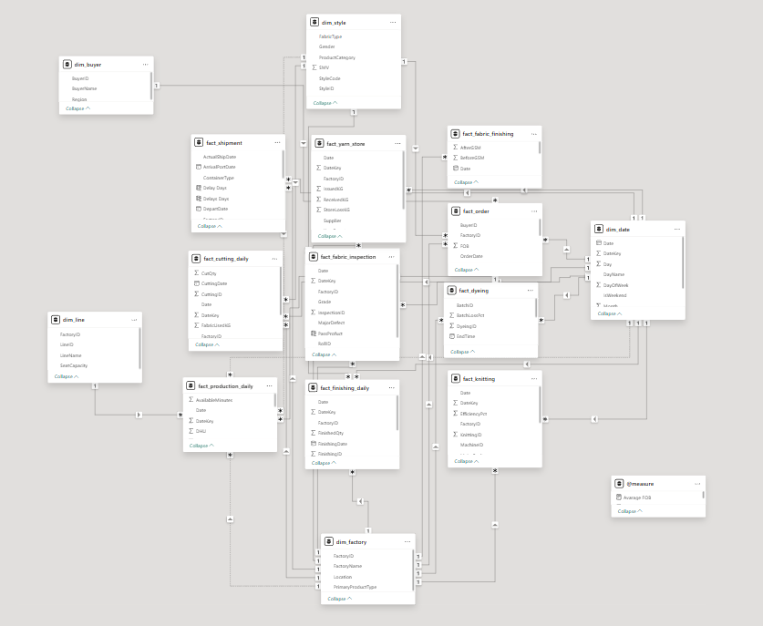
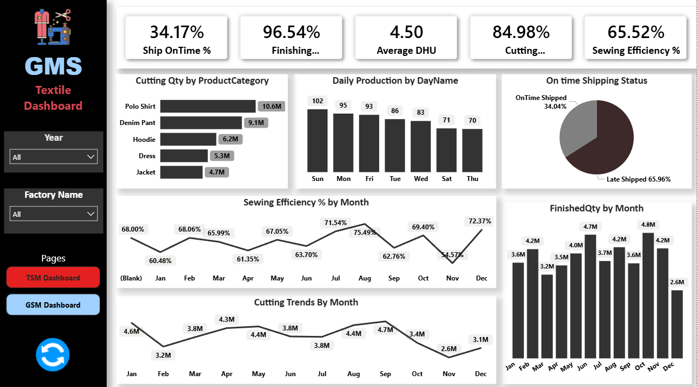

# 🧵 Textile Production Analytics Dashboard (GSM & TSM)

This project presents two interactive **Power BI dashboards** designed to analyze textile manufacturing performance across different stages of production.

The dashboards focus on **Garment Sewing Manufacturing (GSM)** and **Textile Manufacturing Stage (TSM)** to provide insights into production efficiency, quality control, and operational performance.

---
# Data Modeling

---
# 📊 GSM Dashboard Overview

## 1️⃣ GSM Dashboard (Garment Sewing Manufacturing)

This dashboard analyzes the **cutting, sewing efficiency, production output, and shipment performance**.

### Key Metrics

- Ship On-Time Rate: **34.17%**
- Finishing Rate: **96.54%**
- Average DHU (Defects per Hundred Units): **4.50**
- Cutting Efficiency: **84.98%**
- Sewing Efficiency: **65.52%**

### Key Insights

- **Low On-Time Shipping Performance**  
  Only **34% of shipments are delivered on time**, while nearly **66% are delayed**, indicating potential supply chain or production planning issues.

- **Strong Finishing Performance**  
  Finishing processes show high completion rates (**96%+**), suggesting strong performance in the final stage of production.

- **Product Category Production**  
  - Polo Shirts have the highest cutting quantity (**10.6M units**)
  - Denim Pants follow with **9.1M units**
  - Jackets have the lowest production volume.

- **Daily Production Pattern**
  - Sunday shows the highest production (**102 units**)
  - Production decreases slightly towards the end of the week.

- **Monthly Sewing Efficiency Trend**
  - Efficiency peaks in **August (75.49%)**
  - Lowest performance occurs in **November (54.57%)**
  - Overall efficiency fluctuates throughout the year.

- **Cutting Trends**
  - Peak cutting occurs in **September (4.7M units)**.
  - Lowest cutting production occurs in **November (2.6M units)**.

- **Finished Quantity Trend**
  - Production peaks around **October–November (4.8M units)**.
  - December shows a significant drop (**2.6M units**).

---

# 📊 TSM Dashboard Overview

## 2️⃣ TSM Dashboard (Textile Manufacturing Stage)

This dashboard focuses on **fabric production, knitting efficiency, dyeing processes, and quality inspection**.

### Key Metrics

- Knitting Output: **403K KG**
- Knitting Efficiency: **96.37%**
- Dyeing Reprocessing Rate: **12.33%**
- Fabric Inspection Pass Rate: **60.22%**
- Fabric Yield: **93.07%**

### Key Insights

- **High Knitting Efficiency**
  Knitting processes maintain very strong efficiency (**96%**), indicating optimized machine utilization.

- **Moderate Fabric Inspection Pass Rate**
  Fabric inspection pass rate is **60%**, suggesting that **40% of fabric requires rework or rejection**, highlighting quality control challenges.

- **Defect Distribution**
  The most common fabric defects include:
  - Crease Marks (~19%)
  - Uneven Dye (~17%)
  - Needle Line (~17%)
  - Hole defects (~16%)

- **Monthly Inspection Trends**
  Inspection pass counts fluctuate throughout the year, peaking around **November** and dropping sharply in **December**.

- **Knitting Output Trends**
  Production remains relatively stable between **32K–38K KG per month**, with slight peaks during mid-year.

- **Dyeing Reprocessing**
  Dyeing reprocessing rates vary across months, indicating variability in dyeing quality control.

- **Fabric GSM Distribution**
  Fabric GSM before and after processing remains nearly balanced (~50/50), suggesting consistent fabric finishing performance.

---

# 🛠 Tools & Technologies

- **Power BI**
- Data Modeling
- DAX Measures
- Data Visualization
- Textile Manufacturing KPIs

---

# 🎯 Business Value

These dashboards help textile manufacturers:

- Monitor production performance
- Identify bottlenecks in cutting, sewing, and dyeing processes
- Track quality defects
- Improve shipment reliability
- Optimize production planning

---

- 🌐 **Live Dashboard (Power BI Service):**  
https://app.powerbi.com/view?r=eyJrIjoiMWU0ZWVjOTktZWNjNi00M2VlLTg3MmYtZjU0YmU0Nzk5MjRkIiwidCI6IjVjMzYwNmU0LWJlNTYtNDc3NC05Y2RmLTUwMDc3YzliZjlmZSIsImMiOjEwfQ%3D%3D
---

# 🔗 Author

**Riyad Shikdar Arin**  
Aspiring Data Analyst| Excel | Power BI | SQL | Python  

## 📬 Contact

- LinkedIn: https://www.linkedin.com/in/riyad-shikdar-arin-3bb348288/

# ⭐ If you found this project useful

Consider giving the repository a **star ⭐**.
